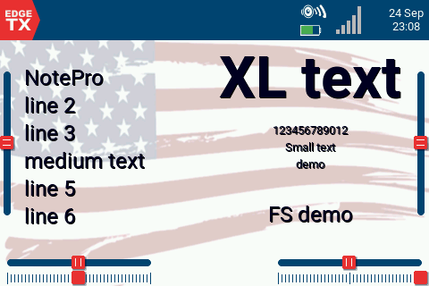
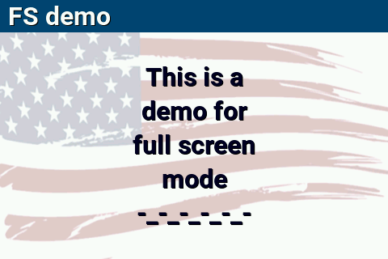
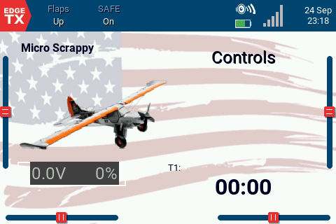
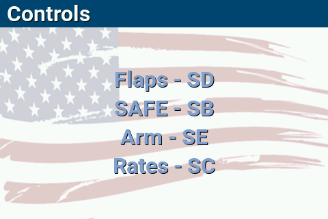
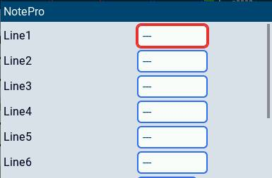
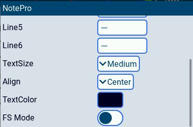

# NotePro — EdgeTX Text Display Widget

NotePro is a widget for [EdgeTX](https://edgetx.org/) radios that lets you display up to 6 lines of custom text on your display.

### Features
- Display up to 6 lines of custom text 
- Alignment control
- Adjustable font size
- Customizable text color  
- FS Mode: When enabled, line 1 will be displayed on the home screen. Tap and hold the widget to enter Full Screen. Here, line 1 will be the header, and lines 2-6 will be in the body. 

## Demo Model

## Usage Example

# Settings
- Lines 1-6 (Max of 12 Characters per line)
- TextSize (Small, Medium, Large, XLarge)
- Align (Left, Center, Right)
- TextColor
- FS Mode (Off, On)

# Installation
Drag the NotePro folder into the **WIDGETS** folder on the radio.

---
# Additional Notes
- The limit of 12 characters per line is due to EdgeTx and can not be adjusted.
- If FS Mode is not enabled, when you enter the full screen widget, line 1 will display in the header and the body.
- Not recommended to use in the top bar.
- Only for color radio screens.
- Tested on a TX16s and TX15.
